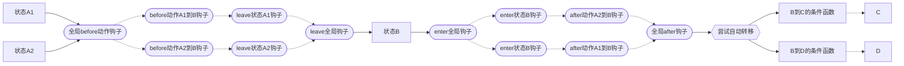

# auto-state-machine

A finite state machine that supports transiting state automatically.

# 中文文档

## 状态图配置

```ts
{
  before: function,
  after: function,
  enter: function,
  leave: function,
  state: string,
  event: EventMan,
  graph: [{
    state: string,
    enter: function,
    leave: function,
    // enterEvent?: string,
    // leaveEvent?: string,
    to: [
      {
        state: string,
        condition: function,
        before: function,
        after: function,
        // beforeEvent?: string,
        // afterEvent?: string
      },
    ]
  }]
}
```

## 状态机流程

### 状态转移过程


